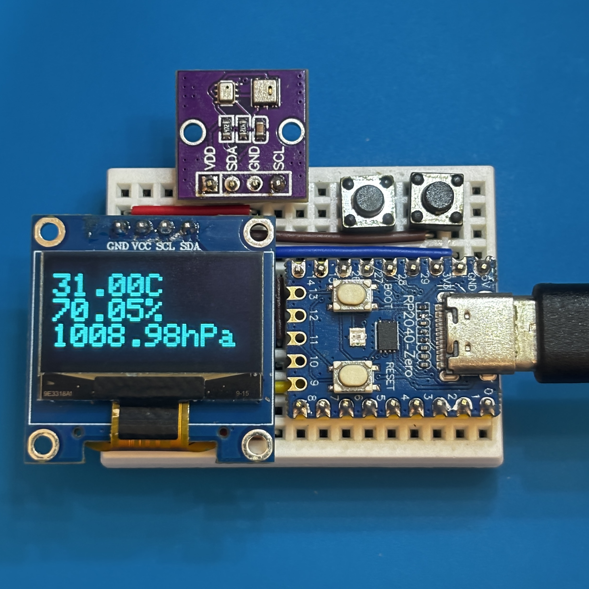
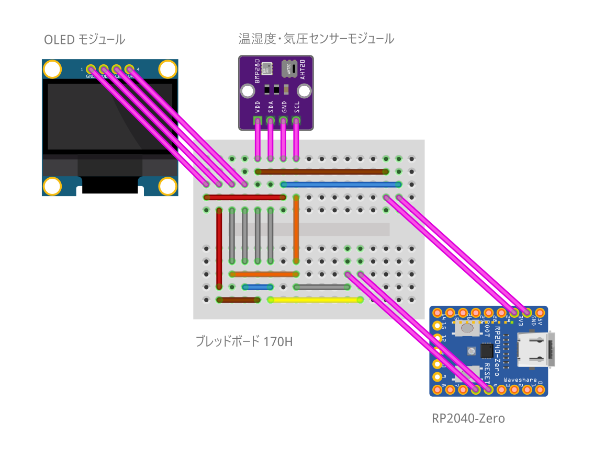

# Arduino: RP2040-Thermohygrometer

RP2040-Zero を使用したコンパクトな温湿度・気圧計です。

## 部材

- RP2040-Zero 1個
- OLED モジュール（0.96" 128x64 SSD1306） 1個
- 温湿度・気圧センサーモジュール（AHT20+BMP280） 1個
- ミニブレッドボード 1個
- ジャンパーワイヤ 14本

## 接続

### OLED ディスプレイ

| OLED モジュール | RP2040-Zero |
|---|---|
| VCC | 3.3V |
| GND | GND |
| SDA | GPIO 4 (SDA) |
| SCL | GPIO 5 (SCL) |

### 温湿度・気圧センサーモジュール

| 温湿度・気圧センサーモジュール | RP2040-Zero |
|---|---|
| VCC | 3.3V |
| SDA | GPIO 4 (SDA) |
| GND | GND |
| SCL | GPIO 5 (SCL) |

## 配線図

## 開発環境

- IDE: Arduino IDE
- ライブラリ:
  - Adafruit AHTX0
  - Adafruit BMP280 Library
  - Adafruit GFX Library
  - Adafruit SSD1306

## ライセンス

このプロジェクトは [MIT ライセンス](./LICENSE) の下で公開されています。
自由に使用、改変、再配布していただけます。
