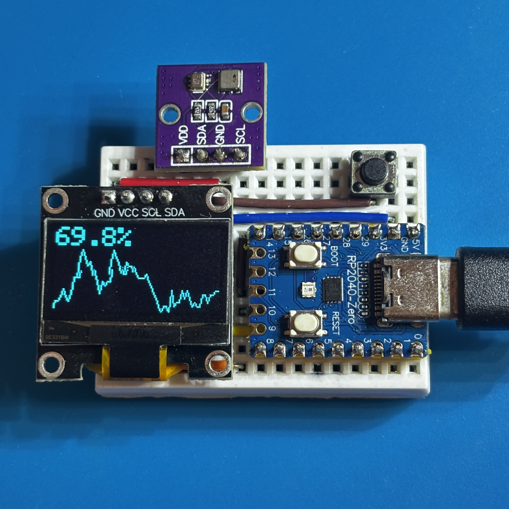
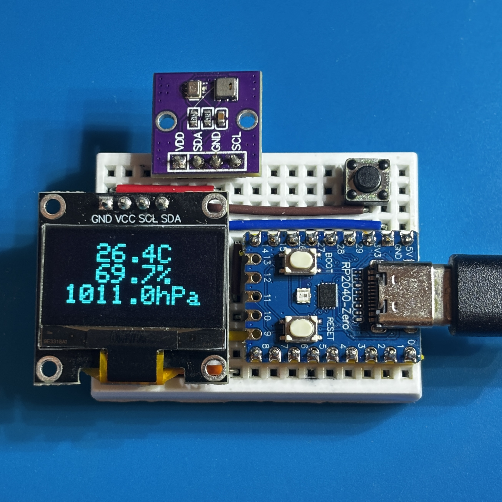

# Arduino: RP2040-Thermohygrometer

グラフ表示に対応したコンパクトな温湿度・気圧計です。


温湿度と気圧のグラフ表示と上下反転表示に対応しています。

<div>






</div>

## 部材

| 種別 | 型番など | 数量 |
|:-----|:---------|:-----|
| ブレッドボード | 170H | 1個 |
| マイコン | RP2040-Zero | 1個 |
| ジャンパーワイヤ | - | 12本 |
| タクトスイッチ | 2P 6x6mm | 1個 |
| OLED モジュール | 0.96" 128x64 SSD1306 | 1個 |
| 温湿度・気圧センサーモジュール | AHT20+BMP280 | 1個 |

## 配線図


## プログラム開発環境

### 統合開発環境

| 名前 | 説明 |
|:-----------|:-----|
| Arduino IDE | 統合開発環境 |

**インストール**: 公式サイト [https://www.arduino.cc/en/software/#ide](https://www.arduino.cc/en/software/#ide) からダウンロード・インストール

### ボードサポートパッケージ

| 名前 | 説明 |
|:------|:-----|
| Raspberry Pi Pico/RP2040/RP2350 | ボードサポートパッケージ |

**インストール**:
1. Arduino IDE の「ファイル」→「環境設定」→「追加のボードマネージャのURL」に以下を追加:
   ```
   https://github.com/earlephilhower/arduino-pico/releases/download/global/package_rp2040_index.json
   ```
2. ボードマネージャーで「Pico」または「RP2040」を検索・インストール

### 依存ライブラリ

| ライブラリ | 説明 |
|:-----------|:-----|
| Adafruit AHTX0 | AHT20温湿度センサー制御 |
| Adafruit BMP280 Library | BMP280気圧センサー制御 |
| Adafruit NeoPixel | NeoPixel LED制御 |
| Adafruit SSD1306 | SSD1306 OLEDディスプレイ制御 |
| DigitalButton | タクトスイッチ制御 |

**インストール**: Arduino IDEのライブラリマネージャーで検索・インストール

## 操作

マイコンに電源を供給すると作動します。
定期的に温湿度・気圧を測定して、OLED に表示します。

ボタンを押すと、表示パターンが切り替わります。


ボタンを長押しすると、表示が上下反転します。


## 注意

* センサー素子の表面に触れると、センサーが汚染されて温湿度や気圧が正しく測定できなくなる場合があります

## ライセンス

このプロジェクトは [MIT ライセンス](./LICENSE) の下で公開されています。
自由に使用、改変、再配布していただけます。
