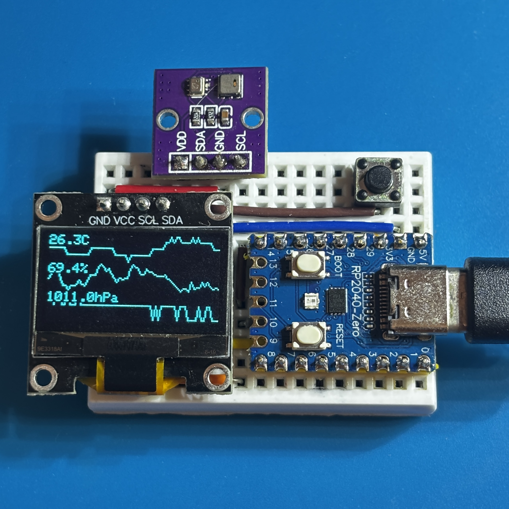

# Arduino: RP2040-Thermohygrometer

RP2040-Zero を使用したコンパクトな温湿度・気圧計です。

## 部材

| 種別 | 型番など | 数量 |
|------|----------|------|
| マイコン | RP2040-Zero | 1個 |
| OLED モジュール | 0.96" 128x64 SSD1306 I2C | 1個 |
| 温湿度・気圧センサーモジュール | AHT20+BMP280 | 1個 |
| タクトスイッチ | 2P 6x6mm | 2個 |
| ブレッドボード | 170H | 1個 |
| ジャンパーワイヤ | - | 12本 |

## 接続

### OLED ディスプレイ

| OLED モジュール | RP2040-Zero |
|---|---|
| VCC | 3.3V |
| GND | GND |
| SDA | GPIO 4 (SDA) |
| SCL | GPIO 5 (SCL) |

### タクトスイッチ

| タクトスイッチ | RP2040-Zero |
|---------|------------------|
| タクトスイッチ #1 PIN 1 | GPIO 26 |
| タクトスイッチ #1 PIN 2 | GPIO 28 |
| タクトスイッチ #2 PIN 1 | GPIO 29 |
| タクトスイッチ #2 PIN 2 | GND |

### 温湿度・気圧センサーモジュール

| 温湿度・気圧センサーモジュール | RP2040-Zero |
|---|---|
| VCC | 3.3V |
| SDA | GPIO 4 (SDA) |
| GND | GND |
| SCL | GPIO 5 (SCL) |

## 配線図

## 開発環境

### 必須ソフトウェア
| ソフトウェア | 説明 |
|------------|------|
| Arduino IDE | 開発環境 |

### 依存ライブラリ
| ライブラリ | 説明 |
|------------|------|
| Adafruit AHTX0 | AHT20温湿度センサー制御 |
| Adafruit BMP280 Library | BMP280気圧センサー制御 |
| Adafruit GFX Library | OLEDグラフィックス描画 |
| Adafruit SSD1306 | SSD1306 OLEDディスプレイ制御 |

**インストール**: Arduino IDEのライブラリマネージャーで検索・インストール

## 操作

マイコンに電源を供給すると作動します。
定期的に温湿度・気圧を測定して、OLED に表示します。

左ボタンを押すと、表示パターンが切り替わります。

右ボタンを押すと、OLED の表示が上下反転します。

## ライセンス

このプロジェクトは [MIT ライセンス](./LICENSE) の下で公開されています。
自由に使用、改変、再配布していただけます。
